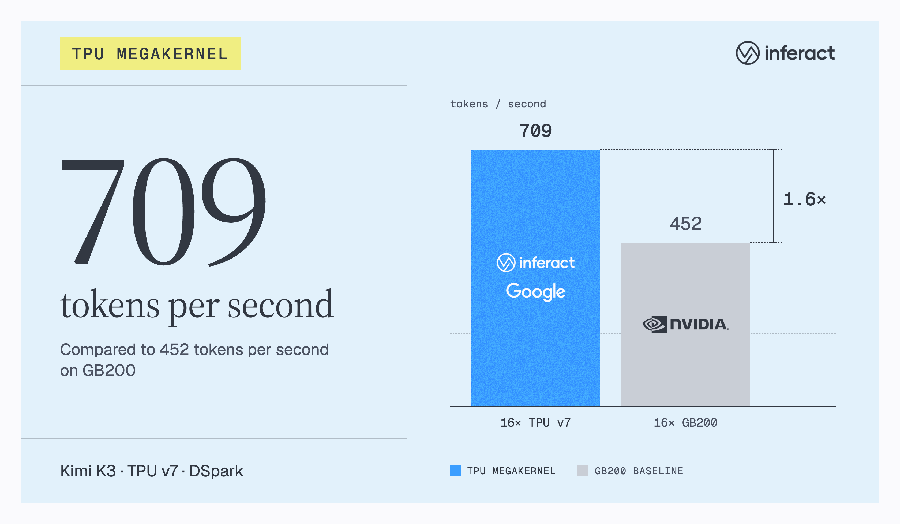

# TPU megakernels for Kimi K3 and Qwen3.8-27B

<p align="center">
  <a href="https://inferact.ai/blog/tpu-megakernels">
    
  </a>
</p>

Companion code for the blog post
[700 TPS on Kimi K3: A Case for TPU Megakernels](https://inferact.ai/blog/tpu-megakernels).

This repository contains fused decode implementations for two models:

- **Kimi K3 + DSpark** runs on 32 TPU devices across four hosts. One megakernel
  executes the KDA, MLA, MoE, residual, normalization, and collective work for
  the target model; DSpark provides fused speculative decoding with one anchor
  and seven draft rows.
- **Qwen3.8-27B + DFlash2** runs on eight TPU devices on one host. Its dense
  BF16 megakernel covers the hybrid gated-delta-net and grouped-query-attention
  stack, with an optional fused DFlash2 speculative-decoding loop.

- **Muse Spark 1.2 (816B-A42B)** runs on the eight TensorCores of four TPU7x
  chips on one host. One grid-less Pallas call per decode step covers all 62
  MoE layers with int4 or vendor-NVFP4 experts fed straight to the MXU, in-kernel
  collectives, a dense-weight ring and KV-cache streaming; see the
  [Muse Spark section](#muse-spark-12-816b-a42b-megakernel) below.

All demos support terminal interaction and an OpenAI-compatible HTTP server.

## Results

With speculative decoding at an acceptance length of 6, the megakernels reach
709 accepted tokens per second on Kimi K3 (16× TPU v7 vs 16× GB200, 1.57×) and
1,515 on Qwen3.8-27B (4× TPU v7 vs 4× GB200, 2.18×):

<p align="center">
  
</p>

DSpark keeps a large lead at shorter acceptance lengths as well:

<p align="center">
  
</p>

Without speculative decoding, the megakernels deliver roughly 1.4–2× the
decode throughput of the GB200 baseline at batch sizes 1 through 8:

<p align="center">
  
</p>

See the [blog post](https://inferact.ai/blog/tpu-megakernels) for the full
analysis and measurement setup.

## Setup

Create the environment from the repository root:

```bash
uv sync
```

The launchers run Hugging Face in offline mode, so the model snapshots must
already be present in the cache selected by `HF_HOME`, or supplied as explicit
local paths. All scripts automatically load an optional, untracked `.env` file
from the repository root. A typical configuration is:

```bash
HF_HOME=/path/to/huggingface
KIMI_PRESHARDED_WEIGHTS=/path/to/kimi-k3-tp32
KIMI_DRAFT_PRESHARDED_WEIGHTS=/path/to/kimi-k3-tp32/dspark
```

The Kimi pre-sharded variables are optional. Without them, the demo prepares
its kernel layouts from `moonshotai/Kimi-K3` and
`RedHatAI/Kimi-K3-speculator.dspark`. The Qwen demo loads
`Qwen/Qwen3.8-27B` and `z-lab/Qwen3.8-27B-DFlash2`; packed weight containers
under `checkpoints/qwen38-tp8` (or `$QWEN_PACKED_WEIGHTS` when set) are used
instead when present. The optional `KIMI_CHECKPOINT_REVISION`,
`KIMI_DRAFT_REVISION`, `QWEN_CHECKPOINT_REVISION`, and
`QWEN_DRAFT_REVISION` variables pin the commits resolved from the `HF_HOME`
cache for the default repositories. Explicit `--checkpoint`,
`--draft`, `--weights`, and `--draft-weights` arguments override these
defaults.

Kimi requires a four-node Slurm allocation with eight TPU devices per host.
Qwen uses one host with eight TPU devices and can run on the first node of any
allocation containing at least one host.

## CPU correctness tests

Run the fast reference and CPU-interpreter tests with:

```bash
JAX_PLATFORMS=cpu uv run pytest -m "not cpu32"
```

Run the complete suite, including 32-device integration tests, with 32 virtual CPU
devices:

```bash
JAX_PLATFORMS=cpu \
XLA_FLAGS=--xla_force_host_platform_device_count=32 \
uv run pytest
```

These tests validate numerical behavior, not TPU-specific Mosaic lowering,
layouts, VMEM capacity, DMA scheduling, collectives, or performance.

## OpenAI-compatible servers

Start the Kimi K3 + DSpark server on a four-node allocation:

```bash
JOBID=<four-node-job> bash scripts/demo_kimi_dspark.sh \
  --serve 0.0.0.0:8000 --context 4096 --max-tokens 512
```

Start the Qwen3.8-27B + DFlash2 server on the first host of an allocation:

```bash
JOBID=<slurm-job> bash scripts/demo_qwen_dflash.sh \
  --serve 0.0.0.0:8000 --context 2048 --max-tokens 512
```

Both servers expose `GET /health`, `GET /v1/models`, `POST /tokenize`,
`POST /detokenize`, `POST /v1/completions`, and
`POST /v1/chat/completions`. Kimi uses DSpark by default and supports greedy
or temperature/top-p generation; `--target-only` serves the target megakernel
without speculation. Qwen uses DFlash2 by default with greedy generation;
`--no-spec` selects its plain single-token decoder. Omit `--serve` to use
either launcher interactively.

## Muse Spark 1.2 (816B-A42B) megakernel

Muse Spark 1.2 is a 62-layer MoE decoder: 8192-wide residual stream, 128 query
and 16 KV heads of dimension 64, 256 routed experts with top-8 routing (4096-wide
expert input and FFN width), sliding-window attention (2048) on three of every
four layers and full NoPE attention on the fourth, a 202k vocabulary with
soft-capped logits. The `musespark/` package serves it on **one host with four
TPU7x chips** (eight TensorCores, one mesh axis `tp` of size 8) with one Pallas
call per decode step:

- **TP8 everywhere.** Attention heads are split eight ways (16 query / 2 KV heads
  per core); every routed expert is split eight ways along its intermediate width,
  so all cores stream the *same* experts of a batch and reduce partial sums; the
  embedding and `lm_head` are vocabulary-sharded; the f32 residual stream and all
  vector maths are replicated and bit-identical on every core.
- **Quantized experts on the MXU.** Either our symmetric int4 group-128
  quantization (container format v1: `bf16 x int4` dots, group scales applied
  through a block-diagonal LHS) or the vendor's NVFP4 checkpoint (format v2: e2m1
  codes bitcast to fp8 in VMEM, block-16 e4m3 scales and per-expert global scales,
  exact products). The kernel infers the format from the container.
- **In-kernel collectives** over the eight cores: reduce-scatter + all-gather
  all-reduces with a bf16 wire, direct all-gathers, and a chip-hierarchical
  all-reduce that first reduces over the two cores of a chip (the ~10x faster
  link) and then across chips, used for the batch-8 expert-output reduction.
- **Weight ring and KV streaming.** A 12 x 2 MiB dense-weight ring keeps 24 MiB
  of DMAs in flight across layer boundaries and into the `lm_head`; four expert
  slots are issued right after routing; the KV cache is streamed in 256-token
  tiles under an online softmax. Explicit VMEM stays below 53 MiB of the 64 MiB.
- **XLA prefill.** A `shard_map` program over the same per-rank weights writes the
  KV cache in the kernel's layout, so the kernel continues from any prompt.

`musespark/README.md` documents the sharding, per-rank layouts, container
formats, kernel phases, VMEM budget, collectives and rounding policy.

### Setup

Convert the Hugging Face checkpoint into a pre-sharded TP8 container once. Both
converters run detached (`logs/convert*.log`) and are resumable:

```bash
bash scripts/convert_musespark.sh          # bf16 snapshot -> int4 g128 container (format v1, 471 GB)
bash scripts/convert_musespark_nvfp4.sh    # vendor NVFP4 Hub repo -> NVFP4 container (format v2, 496 GB)
```

They read their locations from the environment or the untracked `.env`:

```bash
MUSESPARK_CHECKPOINT=/filestore/weights/Muse-Spark-1.2-816B-A42B-open   # HF snapshot (tokenizer, config, bf16 weights)
MUSESPARK_PRESHARDED=/filestore/weights/muse-spark-tp8-int4             # int4 container written by convert_musespark.sh
MUSESPARK_NVFP4_REPO=meta-models/Muse-Spark-1.2-816B-A42B-NVFP4-open    # Hub repo streamed shard by shard
MUSESPARK_NVFP4_PRESHARDED=/filestore/weights/muse-spark-tp8-nvfp4      # NVFP4 container
HF_HOME=/filestore/hf                                                     # download cache of the NVFP4 conversion
```

The NVFP4 conversion downloads one shard at a time, converts it and deletes it,
so it needs disk for the container plus a few shards, not for the 533 GB
checkpoint. The demo and the benchmark take `--weights <container>` (int4 by
default) and `--checkpoint <snapshot>` (tokenizer and `config.json` only).
`MUSESPARK_MEGAKERNEL_SRC` and `MUSESPARK_PY` point the launchers at another
checkout or interpreter.

### Demo, server and benchmark

`scripts/demo_musespark.sh` runs one process over the four chips
(`TPU_VISIBLE_CHIPS=0,1,2,3`, `XLA_FLAGS=--xla_allow_excess_precision=false`,
compilation cache in `.jax_cache`); loading a container takes a few minutes.

```bash
bash scripts/demo_musespark.sh                                             # interactive: type at "prompt>"
bash scripts/demo_musespark.sh --prompt "What is 2+2?" --greedy --max-tokens 200
bash scripts/demo_musespark.sh --weights /filestore/weights/muse-spark-tp8-nvfp4 --prompt "..."
bash scripts/demo_musespark.sh --serve 0.0.0.0:8000 --context 8192 --max-tokens 512
bash scripts/benchmark_musespark.sh                                        # B in {1, 2, 4, 8} at context 4096
```

Prompts are rendered with the model's chat template (`--reasoning-effort`
selects the reasoning strength, `--raw` sends plain text); every prompt is
prefilled into its own KV-cache row and the batch (`--batch` 1, 2, 4 or 8 rows)
runs `--steps-per-call` decode steps per device call. Generation is greedy
(`--greedy`) or sampled with temperature / top-k / top-p (defaults 1.0 / 64 /
1.0). The server exposes the same endpoints as the Kimi and Qwen servers and
answers one request at a time on row 0. The benchmark reports ms/step, aggregate
tokens/s and prefill time per length bucket under `benchmark-results/`.

### Tests

CPU tests need eight virtual host devices; the Pallas bodies run in interpret
mode, so every kernel component and the whole decode step are checked against the
pure-JAX reference on the MINI configuration (4 layers, 16 experts, same code):

```bash
JAX_PLATFORMS=cpu XLA_FLAGS=--xla_force_host_platform_device_count=8 \
  .venv/bin/python -m pytest tests/test_musespark_*.py -q       # 147 passed, 22 skipped
```

On the TPU host the same files run on hardware: component tests
(`test_musespark_attention.py`, `_moe.py`, `_stream.py`, `_fp4.py`) on a single
chip (`TPU_VISIBLE_CHIPS=<chip> TPU_CHIPS_PER_PROCESS_BOUNDS=1,1,1
TPU_PROCESS_BOUNDS=1,1,1`), and the eight-core tests (`test_musespark_collectives.py`,
`_decode.py`, `_decode_fp4.py`, `_prefill.py`) with all chips visible, e.g.

```bash
XLA_FLAGS=--xla_allow_excess_precision=false \
  .venv/bin/python -m pytest tests/test_musespark_decode.py tests/test_musespark_prefill.py -s
```

`tests/test_musespark_real_prefill.py` and `tests/test_musespark_real_decode.py`
load the real container (run each alone) and compare against the oracle written
by `scripts/validate_musespark_prefill.py`; `scripts/validate_musespark_decode.py`
is the replay / generation / benchmark harness behind them, and
`scripts/compare_official_musespark.py` checks the JAX reference against the
official sglang layer maths on CPU.

### Results

Decode at context 4096, every row a 151-token prompt, 128 timed steps of 16 per
device call (`scripts/validate_musespark_decode.py --tasks bench`; int4:
`logs/validate_musespark_decode_20260926T052025Z.log`, NVFP4:
`logs/validate_musespark_decode_20260926T051551Z.log`):

| batch | int4 g128 ms/step | tokens/s (aggregate) | NVFP4 ms/step | tokens/s (aggregate) |
|------:|------------------:|---------------------:|--------------:|---------------------:|
| 1     | 3.59 | 278   | 3.82  | 262 |
| 2     | 3.71 | 540   | 6.98  | 287 |
| 4     | 3.91 | 1,022 | 6.60  | 606 |
| 8     | 4.29 | 1,864 | 10.40 | 769 |

At batch 1 the int4 step reads 7.0 GB per core, a 2.19 ms floor at 3.2 TB/s (61 %
bandwidth utilisation); the first kernel version took 4.53 ms. NVFP4 matches int4
at batch 1 (the expert phase stays HBM-bound) but its block-16 scale dots become
MXU-bound at larger batches, the main open item. `scripts/benchmark_musespark.sh`
(the demo's `--bench`, 64 steps per call) measures 3.64 / 3.81 / 4.01 / 4.36 ms on
the int4 container. Prefill of a 192-token prompt takes 462 ms (int4) and 317 ms
(NVFP4, Pallas dequantization).

GSM8K (`gsm8k_cot`, 5-shot, chat template, greedy, medium reasoning effort, up to
8192 generated tokens, the first 100 test problems of lm-evaluation-harness
through the OpenAI server, `scripts/eval_musespark_gsm8k.sh`):

| container | flexible-extract | strict-match | truncated at the budget |
|-----------|-----------------:|-------------:|------------------------:|
| int4 g128 | 87 % | 53 % | 5 / 100 |
| NVFP4     | 92 % | 57 % | 1 / 100 |

Caveat: flexible-extract scores the *last* number of the answer, so answers
that end with a trailing remark, a unit or an alternative reading are counted
wrong although they contain the gold number (7 of the int4 misses), and
strict-match requires the literal "The answer is N." that the model rarely
writes. The truncated transcripts reach the right answer in the reasoning
channel and then loop until the budget (a greedy-decoding attractor of this
checkpoint, present at low reasoning effort too). No arithmetic errors were found
in either container; excluding truncations and extraction misses both are at
~99 %. Details per run are in the untracked `eval-results/` output
(`eval-results/gsm8k_diagnosis.md`).

### Source layout (`musespark/`)

- `musespark/__init__.py`: `Config` re-export, rounding helpers (`r16`, `rms`),
  RoPE, routing, the pure-JAX reference model (dense bf16 or quantized experts),
  canonical weights and `shard_canonical` to the per-rank layout.
- `musespark/config.py`: `Config` (read from `config.json`) and the `MINI` test config.
- `musespark/quant.py`: int4 group quantization and NVFP4 pack / unpack / dequant.
- `musespark/layout.py`: per-rank shapes and dtypes, KV-cache layout, tile schedule.
- `musespark/load.py`: checkpoint streaming, both converters, the on-disk
  containers, device placement, tokenizer.
- `musespark/collectives.py`: in-kernel barrier, all-reduce (flat and
  chip-hierarchical) and all-gather.
- `musespark/stream.py`: the dense-weight bank ring (`fetch` / `gemv`).
- `musespark/attention.py`: per-layer attention with KV-cache streaming.
- `musespark/moe.py`: routing, int4 expert stream, post-expert norm and mixture.
- `musespark/fp4.py`: the NVFP4 twin of the expert stream and the prefill dequant kernel.
- `musespark/decode_megakernel.py`: `make_decode`, the one-call-per-step kernel,
  VMEM budget and options.
- `musespark/prefill.py`: the XLA `shard_map` prefill.
- `musespark/sampling.py`, `musespark/chat.py`: logits post-processing, sampling,
  chat rendering.
- `demo_musespark.py`, `scripts/demo_musespark.sh`, `scripts/benchmark_musespark.sh`,
  `scripts/convert_musespark.sh`, `scripts/convert_musespark_nvfp4.sh`,
  `scripts/validate_musespark_*.py`, `scripts/compare_official_musespark.py`,
  `scripts/eval_musespark_gsm8k.sh`; tests in `tests/test_musespark_*.py`.

## Source layout

- `kimi/decode_megakernel.py`: fused Kimi K3 target decoder, including KDA,
  MLA, MoE, residual/normalization, and collective communication.
- `kimi/dspark.py`: DSpark draft model, fused speculation step, cache
  management, and draft-weight loading.
- `kimi/load.py`: Kimi tokenizer, checkpoint streaming, and TP32 weight-layout
  preparation.
- `qwen/__init__.py`: Qwen model configuration and reference equations.
- `qwen/load.py`: Qwen tokenizer, checkpoint loading, TP weight packing,
  packed containers, and device placement.
- `qwen/decode_megakernel.py`: Qwen TP-sharded prefill, fused decode, and
  block verification.
- `qwen/dflash.py`: DFlash2 reference and fused draft/speculation kernels.
- `demo_kimi_dspark.py` and `demo_qwen_dflash.py`: model loading, compilation,
  prefill, generation, metrics, and server orchestration.
- `collectives32.py` and `pool_alias.py`: TPU collective primitives and Pallas
  VMEM aliasing support used by Kimi.
- `openai_server.py` and `distributed_entry.py`: shared HTTP protocol support
  and Kimi multi-host process startup.
- `model_paths.py`: local-path and Hugging Face repository resolution through
  `HF_HOME`.
- `musespark/`: the Muse Spark 1.2 megakernel (see above and `musespark/README.md`).
- `scripts/`: Slurm launchers, correctness evaluations, and performance
  benchmarks for all model families.
- `tests/`: CPU reference, packing, Pallas-interpreter, and integration tests.

Generated weights, checkpoints, compilation caches, evaluation output,
benchmark output, and Slurm logs are excluded from version control.

## Citation

If you use this codebase or build on our results, please cite the companion
blog post:

```bibtex
@misc{novack2026tpumegakernels,
  author       = {Novack, George and Liu, Xuting and Ma, Jeff and Kwon, Woosuk},
  title        = {700 TPS on Kimi K3: A Case for TPU Megakernels},
  howpublished = {\url{https://inferact.ai/blog/tpu-megakernels}},
  year         = {2026},
  month        = sep,
  note         = {Inferact blog post, September 23, 2026},
}
```
